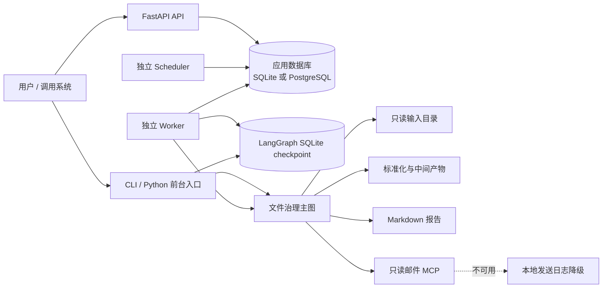
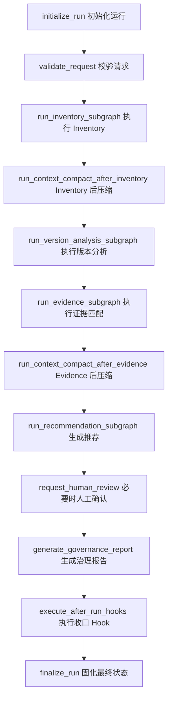

# 1.0.0 架构说明

## 目标与边界

File Manage Agent 1.0.0 是一个基于 LangGraph 的只读文件版本治理系统。它发现并解析
XLSX、DOCX 与文本型 PDF，建立版本组、差异、版本边和证据关系，生成可解释的主版本
建议及 Markdown 报告。系统不会删除、覆盖、移动或重命名原始文件。

1.0.0 同时提供四种运行入口：

- Python/CLI 前台运行；
- FastAPI 后台提交与状态查询；
- 独立 Worker 执行及 SQLite checkpoint 恢复；
- 独立 Scheduler 将持久化 Cron 计划转换为后台队列任务。

## 组件关系

应用数据库与 LangGraph checkpoint 是两套存储：

- 应用数据库保存运行、Memory、Context、工具审计、人工审核、恢复、后台任务、计划和
  Worker 租约等十张表；
- checkpoint 保存 LangGraph 可恢复执行状态，后台运行固定使用 SQLite；
- 两者不得使用同一个 SQLite 文件，也不得位于业务输入目录内。

## 主图收口顺序

主图固定执行以下业务阶段和收口节点。任何阶段的未捕获错误先进入 Error Recovery，
再根据策略重试、降级、人工处理或生成失败报告。

所有条件分支函数均位于 `app/graphs/routers.py`，且由图构建代码通过
`add_conditional_edges` 明确引用。`app/nodes` 只保留注册到图中的节点函数；通用逻辑
位于 `app/services`、`app/tools` 或 `app/utils`。全部状态类及状态子类位于
`app/state/models.py`。

## 后台运行与恢复

API 只负责校验、规范化并持久化请求，不在 HTTP 请求线程执行 LangGraph。Worker 使用
短事务领取任务、建立限时租约并在执行期间续租：

1. API 创建 `governance_run` 和 `background_job`；
2. Worker 原子领取 queued 或 resume_queued 任务，`attempt_count` 仅在领取普通执行时
   增加；
3. Worker 使用任务的 `thread_id` 打开共享 SQLite checkpoint；
4. 图完成时写入终态和报告路径；出现 interrupt 时写入脱敏
   `pending_interrupt` 并释放租约；
5. API 校验 `request_id`、`interrupt_id` 和 `kind` 后幂等写入恢复请求；
6. 新 Worker 进程使用同一 checkpoint 执行 `Command(resume=...)`。

人工恢复只增加 `resume_count`，不会把正常人工等待计为异常重试。Worker 异常退出时，
租约到期后任务可以由其他 Worker 重新领取，且受 `max_attempts` 限制。

## Cron 拓扑

Cron 表达式和 IANA 时区保存在 `scheduled_jobs`。API 可以创建、查询、启用或停用计划；
独立 Scheduler 周期性同步计划。Cron 回调只调用后台提交逻辑，不构建或调用治理图。
因此计划触发、任务领取和业务执行可以独立扩缩容。

## 并发与资源上限

输入扫描由 `request.max_files` 限制，默认配置为 500。PDF 来源匹配使用 LangGraph
`Send` fan-out；调用方可在 RunnableConfig 中设置 `max_concurrency`。自动化验收使用
32 个真实 DOCX 和 32 个 PDF 匹配任务，并明确限制 PDF 并发峰值为 4。

生产部署还应在容器层设置 CPU、内存、进程数和超时上限。增加 Worker 副本时：

- PostgreSQL 使用行锁和 `FOR UPDATE SKIP LOCKED` 支持并行领取；
- SQLite 适合低成本单机部署，不建议用多个高并发 Worker 争用同一文件；
- 单个后台任务仍由一个 Worker 执行，checkpoint 不在 Worker 之间同时写入。

## 数据库与部署

默认 `docker-compose.yml` 使用共享卷中的 SQLite 应用数据库和 checkpoint，包含
迁移、API、Worker、Scheduler 与模拟邮件 MCP。叠加
`docker-compose.postgresql.yml` 后新增官方 PostgreSQL 容器，迁移服务先等待数据库
健康，再为 API、Worker 和 Scheduler 提供统一 URL。

PostgreSQL 只通过 Docker 演示，不要求安装本地数据库服务，也不依赖云数据库。
数据库密码通过 `.env` 注入，不能写入请求 JSON、LangGraph 状态、checkpoint、日志或
报告。即使应用数据库切换为 PostgreSQL，LangGraph checkpoint 仍使用独立 SQLite。

## 只读保证

运行前后的验证清单以输入根目录为基准，记录：

- 普通文件数量；
- POSIX 风格相对路径；
- 文件大小；
- SHA-256。

运行期间所有 JSON、SQLite、报告和标准化内容只能写入 `artifact_root`、
`report_root`、应用数据库目录或 checkpoint 目录。报告下载再次校验登记路径位于本次
任务声明的 `report_root` 内，拒绝符号链接、路径越界、错误扩展名和超限文件。

## 可观测性与降级

API、Worker、Scheduler 和模拟 MCP 输出字段稳定的单行 JSON 日志。邮件 MCP 仅查询
脱敏附件证据；调用失败、超时或响应不合法时记录 `mcp` 非致命错误，并切换到本地发送
日志。两种来源在 `DeliveryRecord.evidence_source` 中明确区分，报告不会把降级伪装成
MCP 成功。
