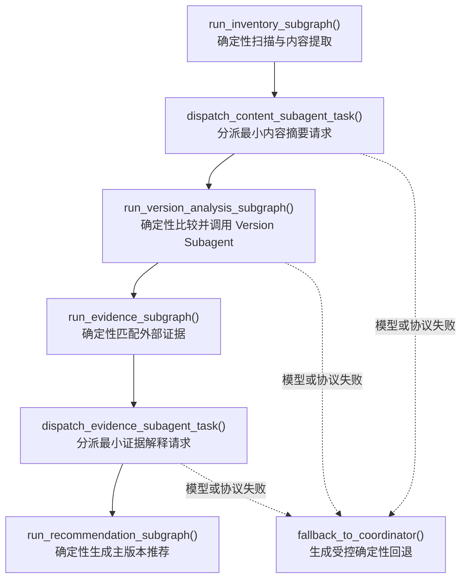

# 0.5.0 固定 Agent Team 正式发布

`0.5.0` 将 `0.4.1` 至 `0.4.4` 的 LLM 基础设施、三个固定 Subagent、Team Protocol、
Team Orchestration 和业务阶段接入收口为正式版本。发布原则没有改变：文件发现、
版本分组、差异事实、版本方向、证据匹配和主版本推荐仍由确定性逻辑负责，模型只解释
已经形成的摘要和证据。

## 发布内容

- 固定成员为 coordinator、Content、Version、Evidence，不支持动态招聘或递归委派。
- Content 在 Inventory 后消费有界预览、结构摘要、关键字段和受控引用。
- Version 在文件对比较内部解释确定性差异，但不能修改方向、相似度、关键修改或置信度。
- Evidence 在确定性 PDF 和发送记录匹配后解释证据摘要，不参与重新评分。
- Team Message 只包含消息标识、真实 Task、固定成员、简短摘要、受控引用、状态和
  已脱敏错误。
- LLM 调用只记录 Provider、模型、状态、耗时、Token 和脱敏错误，不记录 Prompt、
  输出正文或 API Key。
- 模型超时、密钥缺失、结构化输出非法、引用越权或角色子图异常时，协调者保留
  确定性结果并记录 fallback 审计。

## 执行结构



Content 和 Evidence 顶层节点、Version Analysis 内部节点都会调用可复用的 Team
Orchestration 子图。Team Orchestration 是控制面，不替代四个确定性业务子图。

## 配置和示例

安全默认示例不会发起外部请求：

```bash
file-governance run examples/sample_request.json --thread-id governance-safe-001
```

真实 Provider 示例只保存环境变量名称：

```json
{
  "llm": {
    "enabled": true,
    "provider": "openai",
    "model": "gpt-4.1-mini",
    "api_key_env": "OPENAI_API_KEY",
    "temperature": 0.0,
    "max_output_tokens": 800,
    "timeout_seconds": 30.0,
    "fallback_enabled": true
  }
}
```

本地 Docker 运行使用项目根目录下的 `.env`。先从远程仓库中可提交的模板创建本地
文件，再填写真实密钥：

```powershell
if (-not (Test-Path -LiteralPath ".env" -PathType Leaf)) {
    Copy-Item -LiteralPath ".env.example" -Destination ".env" -ErrorAction Stop
}
# 使用本地编辑器把 .env 中的 OPENAI_API_KEY= 填写为真实值。
```

`.env` 必须保持在 `.gitignore` 和 `.dockerignore` 中，远程仓库只提交不含密钥的
`.env.example`。应用不会自动加载 dotenv 文件；Docker 运行时必须显式使用
`--env-file .env`，例如：

官方 OpenAI API 只需要：

```dotenv
OPENAI_API_KEY=你的官方API密钥
```

临时的第三方 OpenAI 兼容中转站支持使用：

```dotenv
OPENAI_API_KEY=中转站提供的API密钥
OPENAI_BASE_URL=https://你的中转站地址/v1
OPENAI_API_MODE=chat_completions
```

`OPENAI_API_MODE=chat_completions` 会跳过 Responses API，直接使用兼容范围更广的
Chat Completions Pydantic parse 路径。中转站仍必须支持 OpenAI 风格的
`/chat/completions`、结构化 `response_format` 和请求中配置的模型名称；不满足这些
条件时会进入既有确定性回退。完整支持 `/responses` 的中转站可以使用 `responses`。

```powershell
docker run --rm `
    --env-file ".env" `
    --mount "type=bind,src=$PWD/data/input,dst=/data/input,readonly" `
    --mount "type=bind,src=$PWD/.artifacts,dst=/data/artifacts" `
    --mount "type=bind,src=$PWD/examples/sample_llm_request.json,dst=/config/request.json,readonly" `
    file-manage-agent:0.5.0 `
    run /config/request.json --thread-id governance-llm-001
```

禁止在请求 JSON、YAML、命令行参数、Team Message 或 checkpoint 中写入实际 API Key；
也不得将 `.env` 复制进镜像或提交到远程仓库。
部署环境可把示例模型名替换为自身支持 Pydantic 结构化输出的模型。

## 兼容性

- `examples/sample_request.json` 默认保持 `llm.enabled=false`，升级不会自动访问网络。
- 关闭真实 LLM 时统一 Client 使用离线 Mock；模型解释不改变 0.4.0 确定性治理结论。
- 0.4.0 状态缺少 `llm`、`team`、`team_messages`、`llm_calls` 时，初始化节点会补齐
  关闭真实模型、固定团队和空审计列表。
- 0.2.0 和 0.3.0 参照路径继续验证 Prompt、Hooks、Task 和 Agent 扩展不会改变旧业务
  结果或报告正文。
- 新增的 `DiffRecord.summary_source`、`summary_message_id`、`summary_artifact_ref` 只描述
  摘要来源；确定性比较事实仍保持原语义。

旧 checkpoint 恢复前应先备份 SQLite 文件。0.5.0 可以补齐缺失顶层字段，但不会迁移
第三方自定义状态字段或修改原始输入文件。

## checkpoint 安全边界

Inventory 解析器产生的 `current_raw_content` 使用 LangGraph `UntrackedValue` 通道。
该值可以在同一次 Inventory 子图执行中传给标准化节点，但不会写入 SQLite checkpoint
或 pending writes。持久化状态只保留有界预览、结构化事实和标准化产物引用。

发布测试会同时检查：

- 关闭并重新打开 SQLite 后可以恢复 Team Message 和 LLM 审计；
- 状态只保存 `api_key_env` 名称，不保存环境变量实际值；
- 最终状态不包含 Subagent 私有 `system_prompt`、`user_prompt`；
- SQLite 主文件、WAL 和共享内存附属文件的原始字节不包含密钥哨兵或长正文尾部。

由于原始解析内容不参与 checkpoint，进程如果恰好在“解析完成、标准化尚未完成”之间
崩溃，应从安全的文件解析步骤重新执行，而不是恢复完整正文内存。

## 发布验收矩阵

| 验收场景 | 自动化覆盖 | 预期结果 |
| --- | --- | --- |
| OpenAI 真实 Provider 适配成功 | `tests/unit/test_llm_client.py::test_openai_provider_uses_structured_api_and_records_usage` | 通过 SDK 兼容 Client 返回 Pydantic 结果并记录 Token |
| Mock Provider 成功 | `tests/unit/test_llm_client.py::test_default_config_uses_mock_without_external_call` | 无网络调用并生成成功审计 |
| 模型超时 | `tests/unit/test_llm_client.py::test_mock_timeout_returns_timeout_audit_without_sleeping` | 输出为空、状态为 timeout、错误已脱敏 |
| API Key 缺失 | `tests/integration/test_llm_unavailable_fallback.py::test_missing_api_key_falls_back_without_changing_governance_results` | 三个角色均 fallback，确定性结论不变 |
| Pydantic 输出不合法 | `tests/unit/test_llm_client.py::test_invalid_mock_payload_returns_failed_audit` | 调用记为 failed，不把非法结果写入业务状态 |
| Subagent 返回非法引用 | `tests/integration/test_subagent_coordinator_fallback.py::test_coordinator_rejects_forged_ref_and_rebuilds_controlled_result` | 拒绝越权引用并生成协调者受控结果 |
| 三个 Subagent 分别失败 | `tests/integration/test_llm_unavailable_fallback.py::test_missing_api_key_falls_back_without_changing_governance_results` | Content、Version、Evidence 均产生 fallback 审计且运行安全收口 |
| 关闭 LLM 与 0.4.0 一致 | `tests/integration/test_v040_compatibility.py::test_disabled_llm_preserves_v040_governance_conclusions` | 版本图、证据、推荐和报告正文一致 |
| 旧 0.4.0 状态升级 | `tests/integration/test_v040_compatibility.py::test_v040_state_without_agent_fields_receives_safe_v050_defaults` | 补齐安全默认状态并正常完成 |
| checkpoint 不含密钥和完整正文 | `tests/integration/test_team_message_checkpoint.py::test_checkpoint_excludes_api_key_and_full_model_input` | 恢复状态和 SQLite 原始字节均通过泄漏检查 |

自动化的 OpenAI 场景使用注入的官方 SDK 接口兼容 Client，不访问公网或消耗真实 Token。
在发布环境中还应使用 `examples/sample_llm_request.json` 完成一次有密钥真实模型 smoke，
确认部署所选模型支持结构化输出；该手工步骤不应在普通 CI 中自动执行。

## 验证命令

```bash
python -m pytest
python -m ruff check app tests
python -m compileall -q app tests
```

构建容器：

```bash
docker build --build-arg APP_VERSION=0.5.0 -t file-manage-agent:0.5.0 .
```

## 不在 0.5.0 范围内

- Worktree、Skills、长期 Memory 和动态 Agent 招聘；
- 邮件或企业协作平台 MCP 证据；
- HTTP API、后台 Worker、定时任务和 PostgreSQL Checkpointer；
- OCR、旧版 `.doc`/`.xls`、宏文件和加密文档自动处理。
