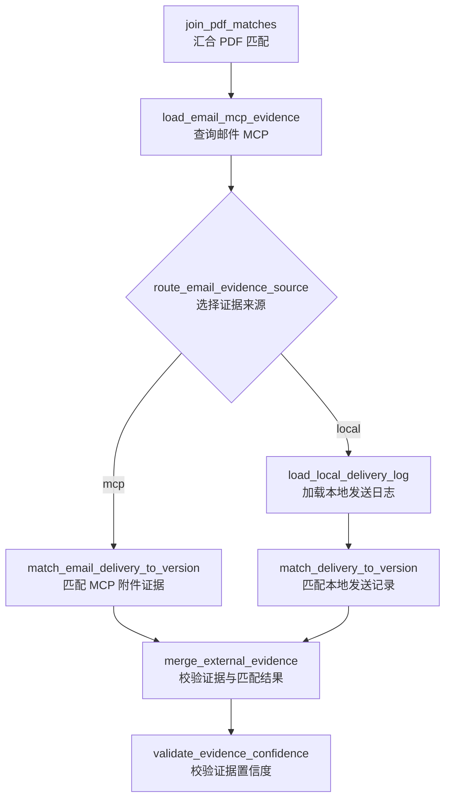
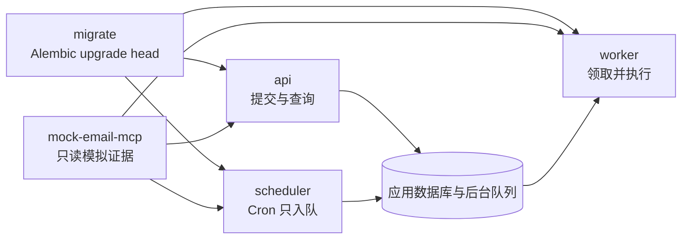

# 0.8.0 模拟邮件 MCP、结构化日志与多服务编排

第三批通过只读模拟邮件 MCP、自动本地证据降级、统一 JSON 日志和 Compose 四服务编排，完成可独立部署的后台文件版本治理运行时。

## 发布范围

0.8.0 保留 0.7.1 的持久化队列、租约 Worker 和 HTTP API，也保留 0.7.2 的
APScheduler 只入队边界与显式仓库写入 Worktree 隔离。本批新增：

- 官方 MCP Python SDK 的 Streamable HTTP 客户端和无状态模拟邮件服务；
- Evidence 子图中的 MCP 优先、本地发送日志降级条件分支；
- `EmailMCPConfigState`、`EmailMCPFetchState` 和 `EmailMCPRecordState`；
- `mcp` Error Recovery 类别及可逆 Alembic 约束迁移；
- API、Worker、Scheduler 和模拟 MCP 共用的单行 JSON 日志；
- 同时启动迁移与四个长期服务的 Docker Compose 编排。

## Evidence 流程



邮件 MCP 可用时不会同时加载本地日志，避免相同发送事实重复加权。MCP 关闭、
连接失败、超时、固定 Tool 缺失或响应协议非法时，查询节点把状态改为
`fallback`，登记脱敏 `mcp` 错误，然后路由到本地日志。顶层 Error Recovery 使用
`partial_result` 登记降级并继续 Recommendation。

无论来源如何，匹配结果都进入既有 `DeliveryRecord`。区别仅由
`evidence_source` 表示：

- `email_mcp`：来自已校验的 MCP 脱敏记录；
- `local_log`：来自显式路径的只读本地日志；
- `manual`：为后续受控人工证据保留。

Recommendation 继续按普通发送最多增加 0.10、客户确认最多增加 0.18 的规则加权。
治理报告新增“来源”列，确保推荐理由可以追溯到 MCP 或本地降级证据。

## MCP 安全边界

客户端只允许发现和调用 `search_sent_email_evidence`，参数固定为当前文件的基础
文件名列表及有限结果数量。它不会：

- 请求邮件正文、真实收件地址、附件内容或认证凭据；
- 执行服务端返回的动态 Tool 名称；
- 跟随 HTTP 重定向；
- 发送、修改、移动、下载或删除邮件。

服务端启动时一次性只读加载不超过 5 MiB 的普通 UTF-8 JSON 文件，拒绝符号链接、
重复记录 ID、非法摘要、无时区时间和非 `email-mcp://` 引用。公开示例位于
`examples/mock_email_data.json`。

## 配置

默认配置关闭邮件 MCP：

```yaml
email_mcp:
  enabled: false
  server_url: http://127.0.0.1:8001/mcp
  timeout_seconds: 5.0
  max_results: 200
```

独立服务支持以下环境变量：

```dotenv
FILE_GOVERNANCE_EMAIL_MCP_ENABLED=true
FILE_GOVERNANCE_EMAIL_MCP_URL=http://127.0.0.1:8001/mcp
FILE_GOVERNANCE_LOG_LEVEL=INFO
FILE_GOVERNANCE_MOCK_EMAIL_MCP_HOST=127.0.0.1
FILE_GOVERNANCE_MOCK_EMAIL_MCP_PORT=8001
FILE_GOVERNANCE_MOCK_EMAIL_MCP_DATA_PATH=examples/mock_email_data.json
```

后台请求信封也可显式提供 `email_mcp` 对象；显式配置优先于环境默认值。

## 统一 JSON 日志

四个长期进程都输出 UTF-8 单行 JSON。公共字段为：

- `timestamp`：带 UTC 时区的 ISO 8601 时间；
- `level`：标准日志级别；
- `service`：`api`、`worker`、`scheduler` 或 `mock_email_mcp`；
- `logger`、`event`、`message`：稳定事件标识与脱敏说明；
- 可选 `run_id`、`job_id`、`worker_id`、`schedule_id` 和 `task_id`。

异常只记录 `exception_type`，不会自动输出堆栈、请求正文、文件内容、Prompt、
MCP 响应正文或凭据。

## Compose 编排

```bash
docker compose up --build
```

服务关系如下：



API 暴露 8000，模拟 MCP 暴露 8001。业务输入以只读方式挂载到 `/data/input`；
应用数据库、报告、产物和 checkpoint 使用同一个可写 named volume，但应用数据库
与 LangGraph checkpoint 仍是不同 SQLite 文件。

## 数据库升级与回退

升级：

```bash
python -m alembic upgrade head
```

`0004_mcp_recovery_category` 只重建 `error_recovery_records` 的类别约束，使
`worktree` 和 `mcp` 错误可安全持久化，不新增应用表。回退到 0003 会恢复旧类别
集合；已经使用新类别的恢复记录应先导出或清理，否则 SQLite 约束重建会拒绝回退。

## 验收矩阵

| 场景 | 预期结果 |
|---|---|
| 模拟 MCP 可用且附件匹配 | 生成 `email_mcp` DeliveryRecord |
| MCP 客户确认记录 | Recommendation 候选分按确认规则提高 |
| MCP 关闭 | 不建立网络连接，直接读取本地日志 |
| MCP 连接失败或协议非法 | `email_mcp_fetch=fallback`，登记 `mcp` 错误并读取本地日志 |
| 四类服务记录事件 | 均为相同公共字段的单行 JSON |
| Compose 启动 | 迁移完成后 API、Worker、Scheduler 与模拟 MCP 可独立运行 |
| Scheduler 触发 | 只创建后台任务，不调用 LangGraph |
| 普通治理 Task | 不创建 Worktree |
| 显式仓库写 Task | 继续遵守 0.7.2 Worktree 创建、检查和安全关闭边界 |
