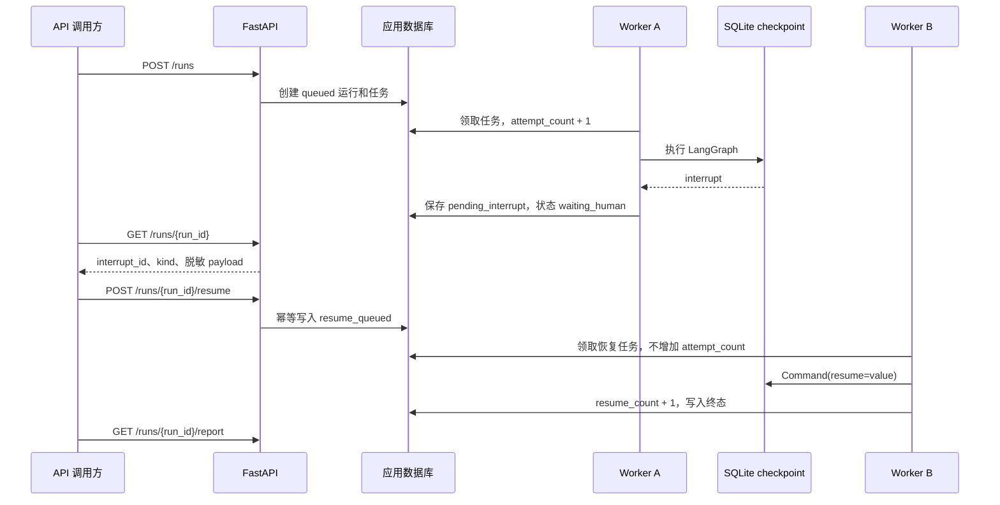

# 后台恢复与人工确认

## 统一工作流



API 和 Worker 都可以在暂停期间重启，只要应用数据库和 checkpoint 文件仍然存在并使用
原 `run_id`、`thread_id`。

## 查询中断

`GET /runs/{run_id}` 的 `background_job` 在暂停时包含：

```json
{
  "status": "waiting_human",
  "attempt_count": 1,
  "resume_count": 0,
  "pending_interrupt": {
    "interrupt_id": "当前中断唯一身份",
    "kind": "file_governance_review",
    "payload": {},
    "created_at": "2026-07-27T00:00:00+00:00"
  }
}
```

调用方不能缓存并长期复用旧 `interrupt_id`。每次恢复前都应重新查询当前状态。

## 主版本人工确认

`kind=file_governance_review` 时，payload 只包含待确认版本组、候选文件 ID、文件名、
分数和推荐理由，不包含正文。请求格式见
`examples/sample_human_review_response.json`：

```json
{
  "request_id": "review-request-001",
  "interrupt_id": "当前 interrupt_id",
  "kind": "file_governance_review",
  "value": {
    "selections": {
      "group-id": "该组内的 file-id"
    },
    "review_note": "可选说明"
  }
}
```

必须为所有 pending group 提供选择，且 file ID 必须属于对应组。空选择、未知组或跨组
文件返回 422。

## 错误恢复型人工确认

`kind=error_recovery` 时，payload 声明 `allowed_actions`。请求格式见
`examples/sample_recovery_response.json`。支持动作：

- `retry`：重新执行固定失败节点，仍受恢复策略最大重试次数限制；
- `skip_file`：仅跳过当前关联文件并登记降级；
- `provide_path`：提供新的只读输入目录并重新执行路径安全校验；
- `abort`：停止后续业务阶段并以失败状态安全收口。

```json
{
  "request_id": "recovery-request-001",
  "interrupt_id": "当前 interrupt_id",
  "kind": "error_recovery",
  "value": {
    "action": "abort"
  }
}
```

请求动作必须在当前 `allowed_actions` 内。`provide_path` 缺少
`replacement_path`、目录不存在、符号链接或与输出/数据库路径重叠时返回 422。

## 幂等与冲突

`request_id` 是调用方生成的恢复幂等键。服务端行为：

| 条件 | 结果 |
| --- | --- |
| 首次提交当前 interrupt、合法 kind 和 value | 202，状态 resume_queued |
| 完全重复同一请求 | 202，返回同一结果，不重复入队 |
| Worker 已应用后再次提交同一请求 | 202，返回已经推进后的状态 |
| 同一 request_id 配不同 value | 409 |
| 旧或未知 interrupt_id | 409 |
| kind 与当前中断不一致 | 409 |
| value 不符合分类型协议 | 422 |
| run_id 不存在 | 404 |

客户端在网络超时后可以安全重试原请求，但不能生成新 `request_id` 来绕过冲突。

## 计数语义

- `attempt_count`：普通执行或异常重领的 Worker 领取次数；
- `max_attempts`：异常重试总上限；
- `resume_count`：已实际应用的人工恢复次数。

进入 `waiting_human` 不会增加异常重试；恢复任务被 Worker 领取也不会增加
`attempt_count`。同一幂等请求最多使 `resume_count` 增加一次。

## 报告获取

运行完成且状态接口返回 `report_available=true` 后：

```text
GET /runs/{run_id}/report
```

服务端根据任务原始请求中的 `workspace.report_root` 重新解析路径，且只允许现有普通
`.md` 文件。路径越界、符号链接或登记路径与本次 report root 不一致返回 409；文件
不存在返回 404。

## 运维排查

暂停后无法恢复时依次检查：

1. API、Worker 是否连接同一应用数据库；
2. Worker 是否使用任务信封中的同一 SQLite checkpoint；
3. 查询到的 `interrupt_id` 是否仍是当前值；
4. `kind` 与提交的 value 协议是否一致；
5. 任务是否已经进入终态；
6. Worker 租约是否过期并已被重新入队；
7. 日志中的 run_id、job_id、thread_id 和 worker_id 是否对应。

不得手工编辑 checkpoint、直接修改任务 JSON 列或重置 attempt/resume 计数。
