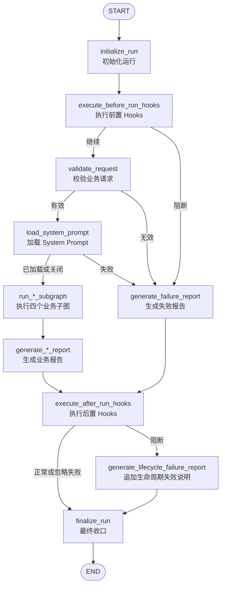

# 0.3.0 Prompt 与生命周期 Hooks

## 版本目标

`0.3.0` 在不改变 Inventory、Version Analysis、Evidence、Recommendation 四个既有
业务子图及其节点的前提下，为顶层文件治理图加入受控 System Prompt 和生命周期
Hooks，并完成 CLI、兼容性、Python 分发包与容器交付。

默认配置同时关闭 Prompt 和 Hooks，因此从 `0.2.0` 升级后可以先保持原有业务行为，
再按部署环境逐项启用新能力。

## 顶层执行顺序



`before_run` 阻断会在读取业务目录前进入失败报告。Prompt 只在不可关闭的请求校验
通过后加载。无论业务结果是成功、无数据还是失败，已生成报告都会经过 `after_run`
Hooks；后置阻断只追加生命周期失败章节，不会覆盖已经获得的业务事实。

## CLI 请求信封与状态边界

CLI 请求信封支持两个可选顶层对象：

```json
{
  "request": {
    "root_directory": "../data/input"
  },
  "prompt": {
    "enabled": false,
    "version": "file-governance-v1",
    "source_path": "../resources/prompts/file_governance_system_v1.md",
    "dynamic_rules": []
  },
  "hooks": {
    "enabled": false,
    "before_run": [],
    "before_model": [],
    "after_model": [],
    "after_run": [],
    "default_failure_policy": "block",
    "failure_policies": {}
  }
}
```

`prompt` 和 `hooks` 由 CLI 单独解析后传给 `create_initial_state()`，不会合并进业务
`RequestState`。Prompt 相对路径以请求 JSON 所在目录为基准。未提供两个对象时，
状态工厂会创建完全关闭的配置。

## Prompt 安全与分发

Prompt 加载器只处理调用方显式配置的本地 `.md` 或 `.txt` 普通文件，并执行以下
约束：

- 拒绝符号链接和允许根目录之外的相对路径；
- 限制资源字节数，只接受严格 UTF-8 文本；
- 不执行模板、命令、代码或网络请求；
- 规范换行、校验动态规则并记录最终内容 SHA-256；
- 加载失败时清空正文和哈希，并生成 `prompt` 类致命错误。

受控资源 `resources/prompts/file_governance_system_v1.md` 同时通过两种方式交付：

- Dockerfile 显式执行 `COPY resources ./resources`，容器运行目录可直接读取资源；
- `pyproject.toml` 使用 setuptools `data-files` 将资源写入 Python 安装前缀下的
  `resources/prompts`，默认路径解析器在源码资源不存在时回退到该安装位置。

Prompt 正文会进入 LangGraph 状态并可能随 Checkpointer 持久化，因此不得在 Prompt
或动态规则中保存密钥、客户正文和其他不应进入 checkpoint 的敏感数据。

## Hook 注册、顺序与失败策略

Hook 只能从静态白名单按名称解析，不支持请求驱动的模块导入、表达式、`eval()` 或
任意代码路径。当前内置 Hook 覆盖请求预检、运行状态补充、最小工具审计入口、
报告检查、审计收口和只读清理。

每个阶段严格按配置列表顺序执行，并为每次执行或跳过生成 `HookEvent`：

- `block`：记录失败事件和致命 `ErrorRecord`，由顶层条件路由进入失败分支；
- `ignore`：只记录失败事件，保留现有业务结果并继续执行后续 Hook；
- `enabled: false`：不调用 Hook；配置列表非空时记录 `skipped` 事件。

Hook 只允许完整更新 `run` 或 `report`，不能修改请求、工作空间、文件事实、版本关系
或推荐结果。

## 0.2.0 兼容性

`tests/integration/test_v020_compatibility.py` 使用当前未修改的四个业务子图重建
`0.2.0` 顶层参照路径，并用同一组真实 DOCX 与 `0.3.0` 关闭配置进行比较。兼容测试
同时显式设置：

```python
prompt_config={"enabled": False}
hook_config={"enabled": False}
```

比较范围包括文件记录、标准化文档、版本组、差异、版本边、分叉、版本链、外部
证据、推荐决策、错误，以及报告摘要、正文和警告。运行时间和报告生成时间等天然
非确定字段不参与比较。

旧 checkpoint 或手工状态缺少 `prompt`、`hooks`、`hook_events` 时，初始化节点会
自动补齐完全关闭的默认值。生命周期字段不会进入 `RequestState`。

## 升级建议

1. 先保持 Prompt 和 Hooks 同时关闭，运行兼容测试并确认现有业务输出。
2. 确认 wheel 或容器中存在受控 Prompt 文件，再单独启用 Prompt。
3. 先启用只读预检和报告检查 Hook，再根据风险为各 Hook 设置 `block` 或 `ignore`。
4. 为 SQLite 或其他 Checkpointer 配置访问控制、加密和保留期限，因为 Prompt 状态
   与 HookEvent 可能被持久化。

`before_model` 和 `after_model` 已有状态协议与 runner 支持，但真实 LLM 调用节点不在
`0.3.0` 范围内。
