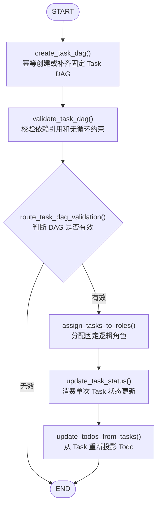

# 0.3.2 独立 Team Orchestration 子图

## 版本目标

`0.3.2` 是从 `0.3.0` 向 `0.4.0` 开发的第二批版本。本批把 `0.3.1` 的固定 Task
DAG 和 Todo 纯投影服务封装为独立 LangGraph 子图，并建立顶层状态转换与同步包装
边界；尚不修改顶层文件治理图的执行顺序。

## 子图结构

子图不配置 Checkpointer，由调用方或未来顶层图统一管理恢复边界。图中没有 LLM、
Subagent、MCP 或文件工具节点。

## 节点职责

### create_task_dag

- 使用 `run.started_at` 作为新 Task 创建时间；
- 旧状态缺少开始时间时优先复用已有 Task 的 `created_at`；
- 调用 0.3.1 的固定 DAG 服务，保留已有状态和时间；
- 异常转换为结构化致命校验错误，不让未捕获异常退出图。

### validate_task_dag

- 验证空 DAG、重复 ID、重复依赖、未知依赖、自依赖和循环；
- 创建或校验失败后由条件路由直接进入 END；
- 无效 DAG 不继续角色分配、状态更新或 Todo 投影。

### assign_tasks_to_roles

- 只写 `assigned_role`；
- 不改变 Task 状态、产物、错误或时间；
- 不创建和调用真实 Agent。

### update_task_status

- 没有 `task_update` 时保持 Task 不变；
- pending 可以进入 running、failed 或 skipped；
- running 可以保持 running，或进入 completed、failed、skipped；
- completed、failed、skipped 只能幂等保持同一终态；
- running 和 completed 要求全部依赖 completed 或正常 skipped；
- failed 必须包含简短 error，running/completed 不允许携带 error；
- output_refs 去重合并，不保存完整正文；
- 更新成功或失败后都清空 `task_update`。

### update_todos_from_tasks

- 不读取旧 Todo 状态；
- 每次根据最新完整 Task DAG 生成四个固定 Todo；
- 继续沿用 0.3.1 的 completed、in_progress、blocked 和 pending 规则。

## 状态隔离

`file_governance_to_team_orchestration_state()` 只传入：

- `run`
- `tasks`
- `todos`
- 本次私有 `task_update`

顶层已有业务错误不会进入子图，避免无关错误影响 DAG 条件路由。

`team_orchestration_state_to_file_governance_update()` 只返回：

- `tasks`
- `todos`
- 子图新产生的 `errors`

`task_update` 不会写回 `FileGovernanceState` 或顶层 checkpoint。

## 本批文件

新增：

- `app/nodes/team_orchestration.py`
- `app/graphs/team_orchestration.py`
- `tests/integration/test_team_orchestration_graph.py`

修改：

- `app/graphs/routers.py`
- `app/state/converters.py`
- `app/nodes/subgraphs_nodes.py`
- `app/graphs/__init__.py`
- `app/nodes/__init__.py`
- `Dockerfile`
- `.dockerignore`
- `.gitignore`
- `README.md`
- `SECURITY.md`
- `pyproject.toml`
- `app/__init__.py`

## 下一批边界

下一批再把 Task 规划和阶段状态同步节点接入顶层 File Governance 图，覆盖 Inventory、
Version Analysis、Evidence、Recommendation、人工确认和报告。真实 Subagent、Team
Protocol 和 LLM Client 仍属于后续版本，不在 `0.3.2` 范围内。
