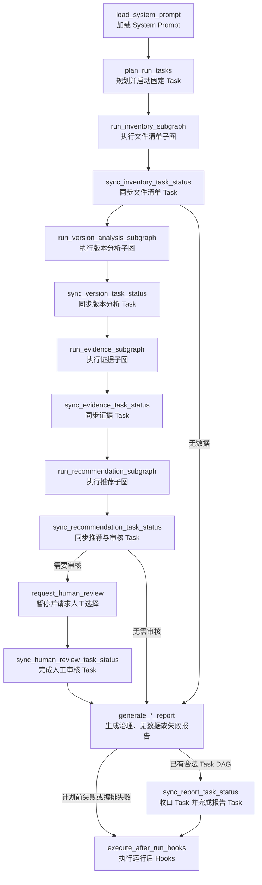

# 0.3.3 顶层 Task 进度与人工审核

## 版本定位

`0.3.3` 是从 `0.3.0` 向 `0.4.0` 开发的第三批版本。本批复用 `0.3.2` 的独立
Team Orchestration 子图，把固定 Task DAG 接入真实顶层治理流程，不修改
`inventory.py`、`version_analysis.py`、`evidence.py` 和 `recommendation.py` 四个
业务节点文件，也不调用 LLM 或 Subagent。

## 顶层流程

`generate_failure_report` 在主图中只注册一次。报告生成后，
`route_failure_report_task_sync()` 检查固定 DAG 和 Team Orchestration 错误：业务阶段
失败已有合法 DAG，先同步 Report Task；请求校验、Prompt 加载或 Task 规划失败无法
安全更新 DAG，直接进入 after-run hooks。

## Task 状态规则

| 路径 | 当前 Task | 后续业务/审核 Task | Report Task | Todo |
| --- | --- | --- | --- | --- |
| 正常自动治理 | 四个业务 Task completed | Human Review skipped，无错误 | completed | 全部 completed |
| 人工审核暂停 | 四个业务 Task completed | Human Review running | pending | 审核 Todo in_progress |
| 人工审核恢复 | 保持 completed | Human Review completed | completed | 全部 completed |
| 无可分析数据 | Inventory completed | 其余业务与审核正常 skipped | completed | 全部 completed |
| 业务子图失败 | 对应 Task failed | 下游带原因 skipped | completed | 业务/审核 Todo blocked |

普通 Task 只能在依赖 completed 或无错误 skipped 后启动。Report Task 是失败报告的
统一收口阶段，因此允许直接依赖以 completed、failed 或 skipped 任一终态结束；
这不会放宽其他业务 Task 的依赖规则。

## 顶层适配节点

- `plan_run_tasks()`：幂等创建、校验、分配固定 DAG，并启动 Inventory；重复调用不
  复制 Task，也不重置终态和时间。
- 四个 `sync_*_task_status()` 业务节点：只读取对应业务 stage 的致命错误；成功时
  完成当前 Task 并启动下一 Task，失败时只标记真实失败源。
- `sync_recommendation_task_status()`：根据既有 `needs_human_review` 结论启动或正常
  跳过 Human Review，不重新计算推荐。
- `sync_human_review_task_status()`：只在恢复值校验并应用到治理结论后完成审核 Task。
- `sync_report_task_status()`：先确定性跳过未执行阶段，再完成 Report Task，确保无
  数据报告不会永久留下 pending Todo。

所有状态更新仍通过 `run_team_orchestration_subgraph()` 进入独立子图。顶层适配节点
不能直接写 Todo，`task_update` 也不会泄漏回 `FileGovernanceState`。

## 兼容与测试

- `test_task_progress.py` 覆盖自动、人工 interrupt/resume、无数据和业务失败路径；
- `test_v030_compatibility.py` 重建不含 Task 适配节点的 0.3.0 顶层参照图，逐项比较
  文件事实、版本关系、推荐、错误、人工状态和报告内容；
- 生命周期测试验证旧状态缺少 `tasks`、`todos` 时自动补齐，以及计划前失败不会
  创建半成品 DAG；
- after-run Hook 阻断发生在 Report Task 完成之后，生命周期失败报告只改变运行
  收口结论，不回滚已经生成的业务报告或 Task 进度。
