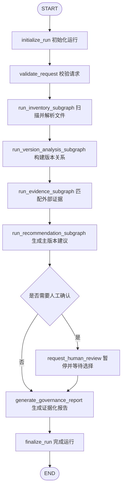

# 0.2.0 第四批：Evidence 接入与治理决策说明

本文说明第四批如何把 Evidence 与 Recommendation 子图接入顶层文件治理流程，
以及 PDF 来源、本地发送记录、推荐评分和最终报告之间的数据边界。文件名中的
`0.4` 表示 `0.2.0` 开发计划的第四批，并非 Python 包版本号。

## 主流程

Version Analysis 从本版开始只负责版本组、差异、版本边、分叉和版本链，不再
提前生成推荐。Evidence 必须在 Recommendation 之前执行，使发送确认和 PDF
来源关系能够参与最终候选评分。

## 本地发送记录协议

本地发送记录使用 JSON `schema_version: "1.0"`。每条 `deliveries` 记录包含：

- `id`：记录的稳定唯一 ID；
- `attachment_name`：发送时的附件文件名；
- `attachment_sha256`：可选的原始附件 SHA-256；
- `normalized_digest`：可选的标准化内容摘要；
- `sent_at`：可选且必须带时区的 ISO 8601 时间；
- `recipient_label`：不包含个人邮箱或地址的脱敏收件人标签；
- `customer_confirmed`：是否存在客户确认、批准或接受记录；
- `evidence_ref`：指向原始业务证据的稳定引用。

工具只读取用户明确提供的普通 UTF-8 JSON 文件，不访问网络、不打开附件、不
执行日志内容，也不修改原始文件。符号链接、未知协议版本、重复 ID、非法摘要、
无时区时间以及超过 10 MiB 的日志都会被拒绝。

## 发送记录匹配优先级

发送记录使用确定性优先级匹配到唯一规范文件：

1. 原始附件 SHA-256 完全一致，置信度 `1.00`；
2. 标准化内容摘要一致，置信度 `0.95`；
3. 完整文件名唯一一致，置信度 `0.85`；
4. 规范化文件名主干唯一一致，置信度 `0.70`；
5. 无唯一候选时保留 `unmatched`，置信度 `0.00`。

完全重复件会折叠到规范文件；如果折叠后仍有多个候选，系统不会依靠排序猜测。
未匹配记录会进入报告的独立章节，但不会参与自动推荐加权。

## PDF 来源匹配

每个已解析、非重复 PDF 只与同一版本组内已解析的 DOCX/XLSX 候选比较。匹配
依据包括标准化摘要、文本相似度、结构特征、文件名和修改时间合理性。默认匹配
阈值为 `0.82`，前两名分差必须至少为 `0.05`；低于阈值或近似并列时保留
`source_file_id = null`，不会建立推测性来源关系。

单个 PDF 匹配失败是非致命错误，其余 PDF 任务和发送日志仍会继续；未知文件、
跨版本组引用、非法分数或自相矛盾的匹配关系属于致命错误。

## 对 Recommendation 的影响

Recommendation 先计算版本链、叶子节点、可编辑格式、修改时间和文件名流程
标记形成的基础分，再按证据确定性调整：

- 普通发送记录按匹配置信度最多增加 `0.10`；
- 客户确认记录按匹配置信度最多增加 `0.18`；
- 可靠 PDF 来源按匹配置信度最多为可编辑源增加 `0.10`；
- 同一来源关系会按置信度最多为 PDF 导出件扣除 `0.06`；
- 所有候选分最终限制在 `0.00` 到 `1.00`。

分叉不会通过分数排序自动消解。检测到分叉、版本链不完整、最高候选近似并列，
或综合置信度低于 `auto_select_threshold` 时，结果必须进入人工审核。无论推荐或
人工选择结果如何，`preserve_file_ids` 始终包含版本组全部成员；推荐不构成删除、
移动、重命名或覆盖文件的授权。

## 报告与错误语义

成功或部分成功报告按版本组展示：

- 完整版本链和候选评分；
- 推荐主版本、选择方式、综合置信度与解释；
- PDF 到可编辑源的匹配分、置信度和信号；
- 已匹配发送记录的脱敏收件人、发送时间、确认状态和证据引用；
- 未匹配发送证据及非致命运行警告；
- 明确的全版本保留策略。

非法或不可读发送日志、单个 PDF 匹配失败会使运行结果成为 `partial`，但仍进入
Recommendation 并生成报告。请求、文件关系、版本链、证据关系或推荐状态存在
致命不一致时，顶层路由进入失败报告，不再继续自动决策。

## 当前限制

- 只支持本地 JSON 发送记录，不直接连接邮箱、网盘或客户系统；
- PDF 只处理可提取文本，不执行 OCR，也不猜测加密密码；
- 不提供自动清理、覆盖或归档动作；
- LLM 摘要器尚未接入，差异摘要保持确定性；
- 证据引用只用于追踪，不会由 Agent 自动打开或执行。
