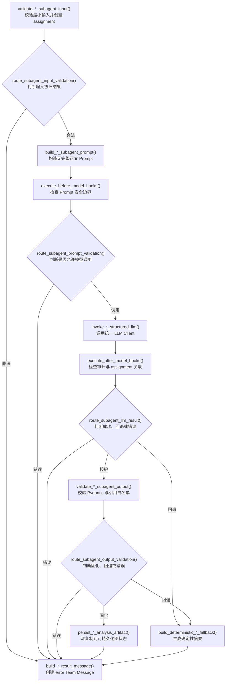

# 0.4.2 三个固定 Subagent 和 Team Protocol

`0.4.2` 是从 `0.4.0` 向固定 Agent Team 演进的第二批。本批在 `0.4.1` 的统一
LLM Client 和状态契约上，实现 Content、Version、Evidence 三个独立 LangGraph
子图及最小 Team Protocol，不改变既有四个业务子图和顶层治理图的执行结果。

## 固定团队

固定注册表只包含以下三项：

| 角色 | Agent ID | Task 类型 | 输入范围 |
| --- | --- | --- | --- |
| Content | `content-subagent` | `inventory` | 短预览、结构摘要、关键字段、引用 |
| Version | `version-subagent` | `version_analysis` | 文件标签、相似度、差异、排序信号、引用 |
| Evidence | `evidence-subagent` | `evidence` | PDF 摘要、发送证据摘要、引用 |

注册表不可由请求动态扩展，不支持动态招聘、递归委派或跨机器 Agent。

## “分支”的 LangGraph 实现

流程图中的菱形表示条件判断，不需要注册成普通 LangGraph 节点。矩形节点先完成
状态更新，随后 `add_conditional_edges()` 调用 `app/graphs/routers.py` 中的路由
函数读取状态并选择下一条边。路由函数本身不执行 LLM、文件或协议写入。

三个子图使用相同的分支骨架：



因此，原框架中的业务函数继续作为矩形节点；新增的四个通用路由函数只被三个图的
`add_conditional_edges()` 调用，符合 `routers.py` 的目录约束。

## 输入边界

- Content `content_preview` 最大 2,000 字符；未知字段和正文型字段被拒绝；
- `structure_summary` 与 `key_fields` 只允许有界 JSON 值，禁止嵌入
  `normalized_text`、`full_text`、`raw_content` 等字段；
- Version 必须恰好包含两个安全文件标签，相似度必须位于 0 到 1；
- Evidence 只接收两段最长 4,000 字符的证据摘要；
- 单次最多携带 50 个非空且不重复的产物引用；
- Subagent 不会打开 `artifact_refs` 指向的文件，Prompt 只包含引用字符串。

## 输出与 Team Protocol

三个 Pydantic 输出都使用 `extra="forbid"`，只允许：

```text
summary
artifact_refs
```

模型返回的引用必须属于当前输入白名单。Team Message 继续使用 `0.4.1` 定义的
十个字段，并增加运行时语义校验：

- sender 和 receiver 必须属于固定 Team 且不能相同；
- assignment 必须由 coordinator 发送；
- result 和 error 必须返回 coordinator；
- error 或 rejected 消息必须包含脱敏错误说明；
- result 引用必须通过当前任务白名单；
- created_at 必须是带时区的 ISO 8601 时间。

输入校验失败、Prompt 安全检查失败、模型失败且禁止回退时，子图仍会创建合法
`message_type="error"` 的 Team Message，不把异常对象或原始模型响应写入状态。

## 确定性回退

`llm.fallback_enabled=true` 时：

- Content 根据结构字段名和关键字段名生成概览；
- Version 复用已有关键修改和排序信号；
- Evidence 合并已有 PDF 与发送证据摘要；
- 输出引用只复制输入白名单；
- 最近一条 `LLMCallRecord` 更新为 `status="fallback"`，并记录
  `fallback_used=true`。

回退不会读取完整正文，也不会把模型生成内容写回原始业务文件。

## 当前整合边界

三个 Subagent 图已经可以独立调用并完整执行 assignment、LLM、校验、回退和结果
消息流程。本批没有修改 Inventory、Version Analysis、Evidence 或 Team
Orchestration 的业务执行顺序。把独立子图包装进现有业务图以及使用 Version
Subagent 更新 `DiffRecord.summary` 属于后续整合批次。

## 验证命令

```bash
python -m pytest
python -m ruff check app tests
python -m compileall -q app tests
```

新增测试覆盖固定注册表、完整正文拒绝、消息成员和引用白名单、三个子图正常路径、
非法输入错误消息、模型非法输出及确定性回退。默认测试只使用 Mock Provider，不
读取 API Key，也不访问网络。
