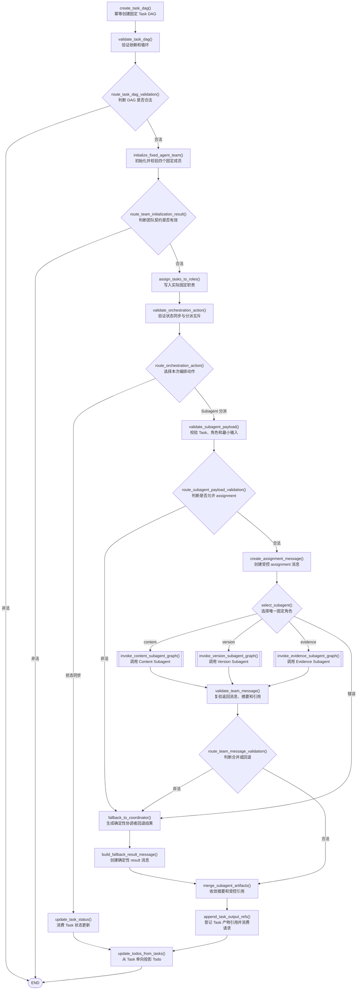

# 0.4.3 固定团队分派与协调者回退

`0.4.3` 是从 `0.4.0` 向固定 Agent Team 演进的第三批。本批把 `0.4.2` 的
Content、Version、Evidence 三个独立 Subagent 接入 Team Orchestration，保留原有
Task 状态同步路径，不修改 File Governance 顶层图或三个业务阶段。

## 编排图

菱形分支均由 `app/graphs/routers.py` 中传给 `add_conditional_edges()` 的纯路由函数
实现；矩形均是 `app/nodes/team_orchestration.py` 中通过 `add_node()` 注册的节点。



## 固定团队约束

- 团队只能包含 `coordinator-agent`、`content-subagent`、`version-subagent` 和
  `evidence-subagent`；成员 ID、role 和 coordinator 不允许动态替换；
- `protocol_version` 必须是 `team-protocol-v1`；并发上限只能位于 1 到 3；
- 本批不配置 Skills，不创建或切换 Worktree，也不允许动态招聘；
- 每次编排调用只处理一个 `task_update` 或一个 `dispatch_request`；
- assignment 期间 coordinator 为 waiting、目标 Subagent 为 working，结果收敛后
  二者恢复 idle。

## 分派与结果边界

编排图先用 `task_id` 定位真实 Task，再检查 Task 类型、`assigned_role` 和固定注册表
是否一致。只有 Inventory、Version Analysis 和 Evidence Task 可以分派；
Recommendation、Human Review、Report、failed 和 skipped Task 会被拒绝。

角色子图返回后，编排层不会直接信任输出，而是再次检查：

- result/error 的 sender、receiver 和 Task ID；
- Pydantic 输出类型是否与固定角色一致；
- Team Message 摘要是否与结构化输出一致；
- 消息引用、输出引用是否都属于当前请求白名单；
- 合法引用才会稳定去重并登记到 `TaskItem.output_refs`。

`dispatch_request` 和 `dispatch_result` 是单次调用私有状态。转换回顶层时只保留
TeamState、Task、Todo、Team Message、LLM 审计和结构化错误，不把最小输入信封或
模型结果对象作为新的顶层字段保存。

## 协调者回退

以下情况进入协调者回退路径：

- 角色子图调用抛出异常；
- Subagent 返回 error Team Message；
- 结构化输出缺失或类型错误；
- result 摘要与 Pydantic 输出不一致；
- Subagent 返回输入白名单以外的产物引用。

回退只调用角色已有的确定性构造器，不读取产物引用指向的文件。结果仍使用固定
Subagent 通道返回合法 result 消息，并把对应 LLM 审计更新为 `status="fallback"`
和 `fallback_used=true`。原始失败错误保留为非致命审计，避免阻断既有确定性流程。

## 当前整合边界

Team Orchestration 已能独立完成三个角色的选择和调用，但 File Governance 顶层图、
Inventory、Version Analysis 与 Evidence 业务阶段尚未创建 `dispatch_request`。
因此正常 CLI 治理路径仍不会调用模型；业务阶段接入属于下一批。

## 验证命令

```bash
python -m pytest
python -m ruff check app tests
python -m compileall -q app tests
```

新增集成测试覆盖三个固定角色的实际选择、Team Message 往返、受控引用登记、动态
成员拒绝、模型失败回退和伪造引用回退。全部测试使用 Mock Provider，不读取 API
Key，也不访问网络。
