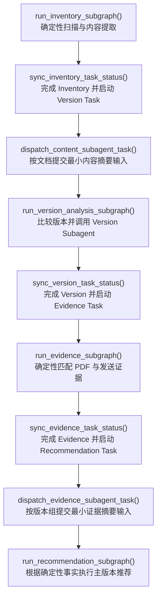
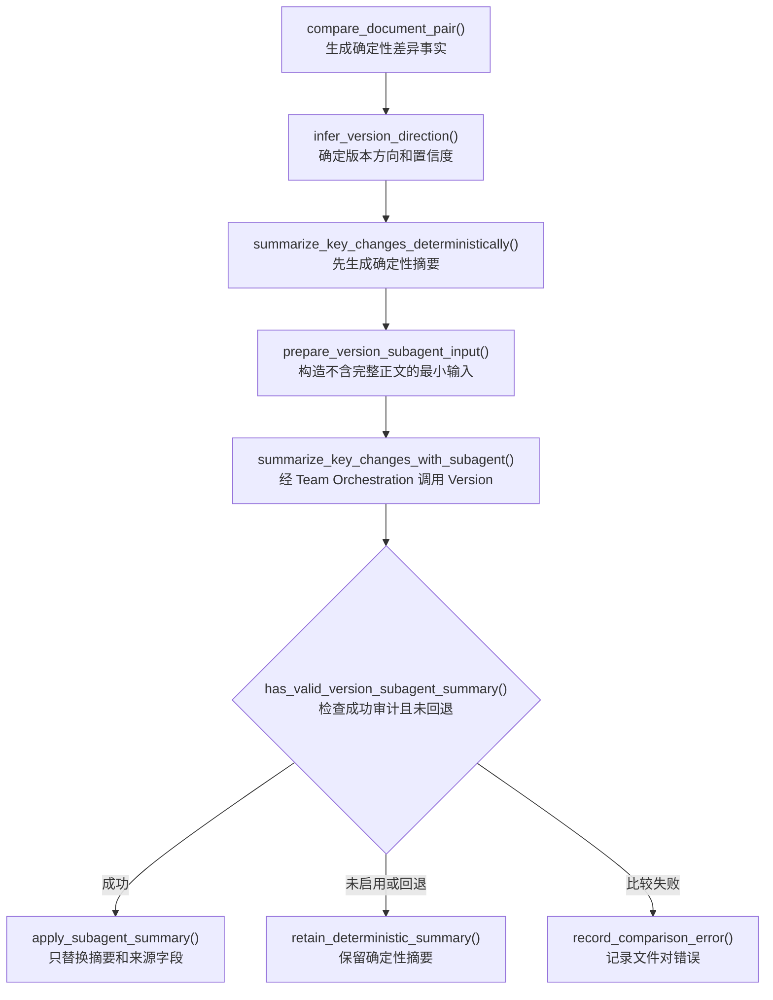

# 0.4.4 三个业务阶段接入固定 Agent Team

`0.4.4` 是从 `0.4.0` 向 `0.5.0` 演进的第四批。本批把 `0.4.3` 已完成的
Team Orchestration 接入真实业务运行：Inventory 后分派 Content，Version Analysis
在文件对比较内部调用 Version，Evidence 后分派 Evidence。Skills、Memory、Worktree
和动态 Agent 招聘仍不在本版本范围内。

## 顶层流程

两个顶层分派节点都调用 Team Orchestration。模型、输出校验和普通协议失败会生成
确定性回退结果；固定 Task DAG 或团队契约发生致命错误时才进入失败报告。

## Version Analysis 摘要升级

Version Subagent 无权修改 `key_changes`、`older_file_id`、`newer_file_id`、相似度、
排序证据或置信度。成功输出只更新：

- `summary`
- `summary_source`
- `summary_message_id`
- `summary_artifact_ref`

模型超时、API Key 缺失、Pydantic 输出非法、引用越权或协调者回退时，以上字段继续
表示确定性摘要来源。

## 状态和安全边界

- Content 输入只包含有界内容预览、结构摘要、关键字段和 `content_ref`。
- Version 输入只包含安全文件标签、相似度、关键修改、排序信号和受控引用。
- Evidence 输入只包含 PDF 匹配摘要、发送证据摘要和受控引用。
- 单次 `dispatch_request`、`dispatch_result` 和 Version 子图临时输入输出不会写回顶层。
- 顶层只持久化 Pydantic 摘要、Team Message、受控引用和脱敏 LLM 审计。
- 生命周期 Hook 不能修改 LLM 配置、固定 Team、Task、Todo、消息或调用审计。
- API Key 仍只能通过 `llm.api_key_env` 指定的环境变量读取。

## 验收

`0.4.4` 新增或升级的集成测试覆盖：

- Content、Version、Evidence 三个固定角色在一次顶层运行中全部被调用；
- Team Message 只包含协议字段，长正文尾部不会进入 checkpoint 状态；
- Version Subagent 成功时只替换摘要并登记消息来源；
- 关闭 Version 摘要与启用摘要时的确定性 Diff 字段完全一致；
- OpenAI API Key 缺失时三个角色均产生 fallback 审计；
- 模型不可用时版本图、证据和推荐结论与确定性基线一致；
- 原有生命周期、Task、人工恢复、证据和 `0.4.0` 兼容性测试继续通过。
