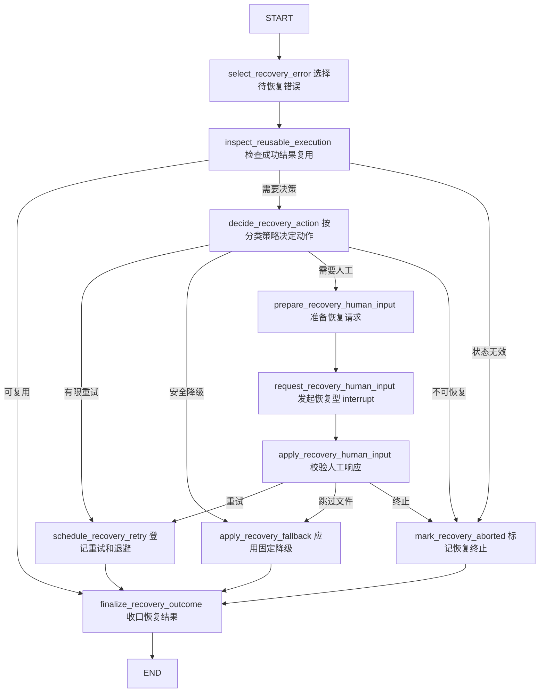

# 0.6.3 Error Recovery 子图与顶层路由

`0.6.3` 是从 `0.6.0` 向 `0.7.0` 演进的第三批。本批消费 0.6.1 的状态协议与策略、
0.6.2 的两张持久化表，在不改变正常治理路径的前提下接入第七个 Error Recovery
子图、顶层失败续跑和成功节点结果复用。

## 本批范围

- 新增独立 Error Recovery 子图及其图节点；
- 把顶层既有 direct-failure 分支统一改到 `run_error_recovery_subgraph`；
- 为六个子图包装节点增加未捕获异常入口；
- 增加 `resume_failed_stage()` 和 `resume_after_failed_stage()` 两个条件路由；
- 依据分类策略执行有限重试、固定安全降级、恢复型人工输入或终止；
- 为可恢复子图生成稳定幂等键、输入摘要和受控状态更新产物；
- 在输入与结果完整性校验通过时复用成功执行；
- 继续保证每次数据库读写只使用独立短事务。

本批不实现多进程 Worker 的任务领取、租约、抢占锁和崩溃竞争协议，也不在图节点内
阻塞等待退避秒数。

## Error Recovery 子图

恢复子图不直接调用业务节点。它只更新结构化错误、节点执行、Task、降级和恢复状态；
顶层条件边读取恢复结果后，才决定重试失败节点或进入预先声明的正常后继。

## 顶层异常入口与续跑

Inventory、两个 Context Compact、Version Analysis、Evidence 和 Recommendation
六个子图包装节点注册统一 `error_handler`。该处理器只执行三件事：

1. 将 `NodeError` 转换为脱敏 `ErrorRecord`；
2. 登记失败的 `NodeExecutionRecord`，并在数据库可用时以短事务持久化；
3. 返回指向 `run_error_recovery_subgraph` 的 `Command`。

它不会决定业务降级。分类策略和最大重试次数只在 Error Recovery 子图内消费。
既有显式失败边也进入相同入口，避免异常和业务错误形成两套恢复语义。

`resume_failed_stage()` 只允许返回固定的可重试节点；复用、降级或跳过动作先进入
`select_resume_after_failed_stage`，再由 `resume_after_failed_stage()` 返回该阶段
预先声明的正常后继。未知、缺失或被篡改的目标统一进入失败报告。

## 幂等执行和结果复用

可恢复包装节点根据运行 ID、Task 执行 ID、节点名和最小输入字段生成稳定幂等键与
输入摘要。执行成功后，最小顶层状态更新被原子写入 `intermediate` 受控目录，并将
引用和 SHA-256 保存到节点执行状态及应用数据库。

复用必须同时满足：

- 幂等键与当前运行、Task 和节点一致；
- 当前输入摘要与记录完全一致；
- 执行状态为 `succeeded` 或 `reused`；
- 状态更新引用位于当前 `artifact_root`，不是符号链接且文件存在；
- 读取后的状态更新摘要与持久化摘要完全一致。

任一条件不满足都会执行真实子图，不能把旧 checkpoint 或被替换的产物当作成功结果。

## 事务和中断边界

结果复用查询、执行开始、执行成功、执行失败和错误恢复状态分别使用独立
`open_application_session()` 上下文。子图执行、条件路由和 `interrupt()` 期间没有
活动 SQLAlchemy `Session`。恢复型人工载荷与主版本选择使用不同 `kind`，只包含
错误 ID、类别、简短信息、固定允许动作和替换路径需求。

策略计算出的 `retry_delay_seconds` 是确定性调度元数据。本批不在图节点或数据库
事务中执行 `sleep()`；后续 Worker 调度层可以依据该字段安排延迟领取。

## 兼容性

- 关闭恢复策略时，恢复入口直接收口为不可恢复并进入失败报告；
- 缺少运行 ID 的独立子图包装调用保留旧版直接执行行为；
- 旧状态仍由 `initialize_run` 补齐空 `recovery`、`node_executions` 和
  `degradations`；
- 正常无错误路径保持原有治理结论、Task 顺序和人工主版本确认协议；
- Error Recovery 的人工中断不会与 `file_governance_review` 响应混用。
