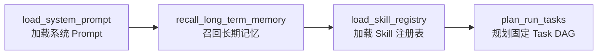
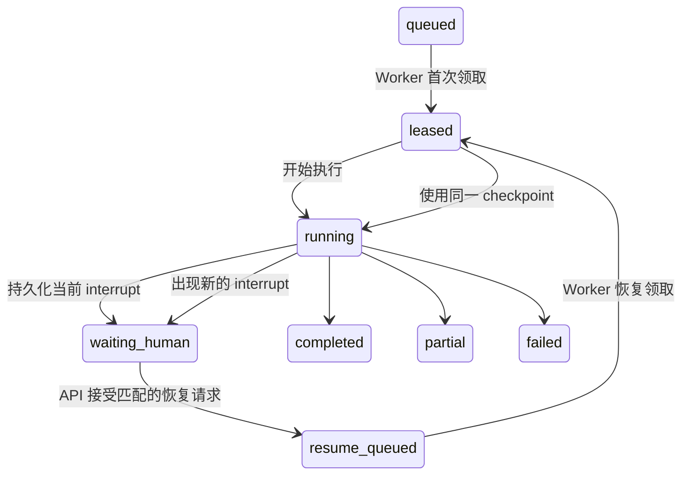

# 0.8.1 主图收口、后台人工恢复与报告获取

`0.8.1` 是从 `0.8.0` 向 `1.0.0` 演进的第一批。本批不扩大文件治理权限，
只收口主图顺序，并让已有两类 LangGraph `interrupt()` 可以由独立 API、Worker
和持久化 checkpoint 跨进程恢复。

## 主图顺序

准备阶段固定为：



成功、无数据和失败报告统一进入同一条收口链：


请求校验等阶段在 Task DAG 创建前失败时，`finalize_run_tasks` 保持空 Task 状态；
DAG 已创建时，它先把未执行上游 Task 确定性收敛到终态，再完成 Report Task。

## 后台恢复状态

`background_jobs` 新增：

- `pending_interrupt`：当前中断 ID、`kind`、最小公开载荷和持久化时间；
- `resume_state`：幂等键、中断身份、值摘要、pending/applied/failed 状态和时间；
- `resume_count`：成功应用的人工恢复次数；
- `resume_queued`：恢复请求等待 Worker 领取时使用的队列状态。

`attempt_count` 只记录首次执行和异常重试。正常人工恢复领取不会增加该计数；
恢复执行本身发生异常时，才按异常重试规则消耗次数。

状态转换如下：



## API

状态接口在 `background_job.pending_interrupt` 中公开恢复所需的最小载荷：

```http
GET /runs/{run_id}
GET /runs/jobs/{job_id}
```

提交恢复：

```http
POST /runs/{run_id}/resume
Content-Type: application/json
```

请求必须包含：

```json
{
  "request_id": "调用方幂等键",
  "interrupt_id": "当前中断 ID",
  "kind": "file_governance_review",
  "value": {
    "selections": {
      "group-id": "file-id"
    }
  }
}
```

相同幂等键、中断身份、协议类型和值摘要的重复请求返回当前任务状态；相同幂等键
携带不同内容、过期 `interrupt_id`、`kind` 不匹配或任务不在可恢复状态时返回
`409 Conflict`。恢复对象不符合 JSON、协议或大小边界时返回 `422`。

下载报告：

```http
GET /runs/{run_id}/report
```

接口只返回当前任务 `workspace.report_root` 内存在的 `.md` 或 `.markdown` 文件，
拒绝符号链接、解析后路径越界、非普通文件、未知扩展名和超过 16 MiB 的报告。

## 迁移与验收

升级：

```bash
python -m alembic upgrade head
```

只回退本批：

```bash
python -m alembic downgrade 0004_mcp_recovery_category
```

本批自动化验收覆盖：

- 主版本审核与错误恢复两种中断均可通过 API 暂停和恢复；
- 恢复请求在 pending 和 applied 后均保持幂等；
- 过期中断 ID 与幂等键冲突被拒绝；
- 正常恢复不增加 `attempt_count`，只增加 `resume_count`；
- 报告可以下载，路径越界被拒绝；
- Alembic 0005 可升级、回退、重放并通过 ORM 元数据一致性检查；
- 主图准备阶段和报告收口阶段符合 `1.0.0` 第一批路线。
